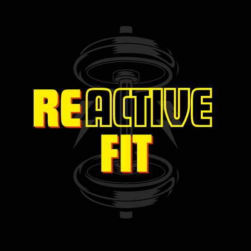
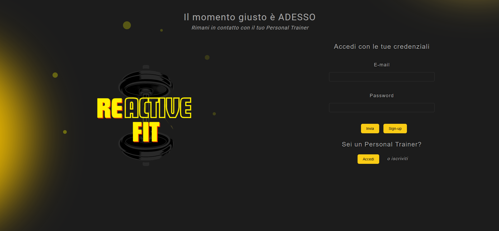
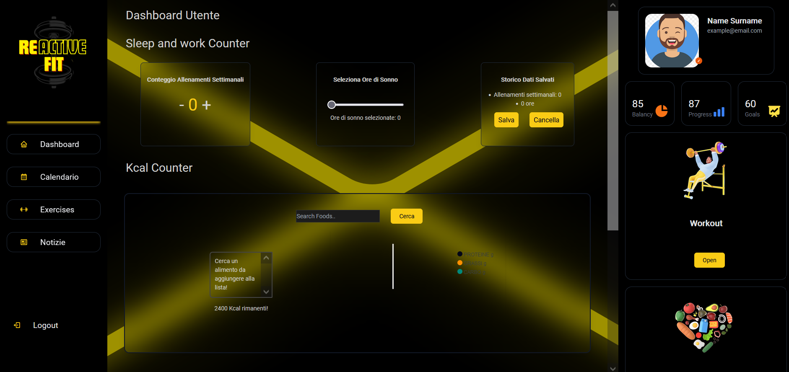
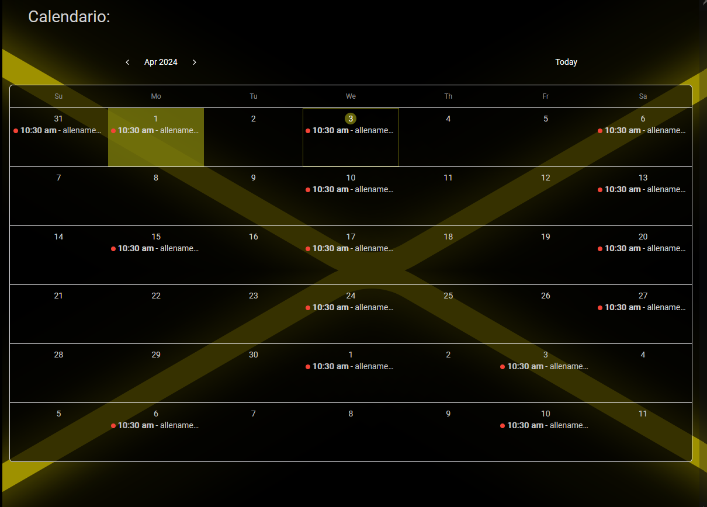
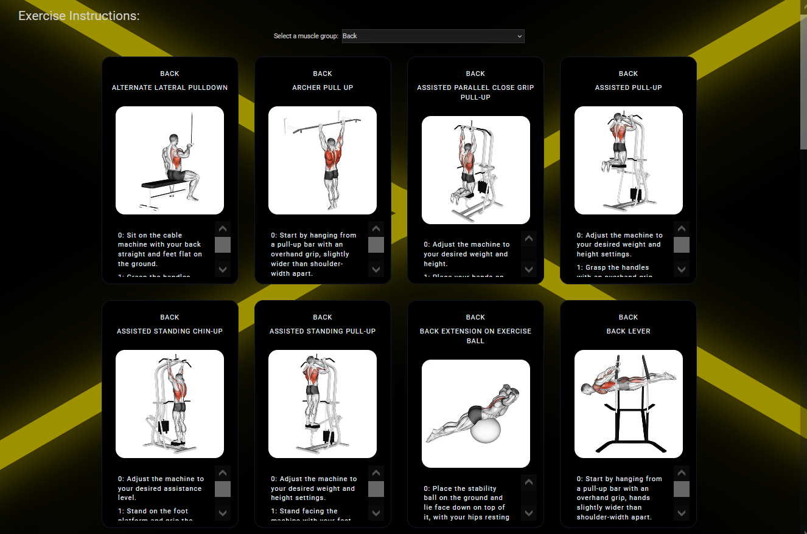
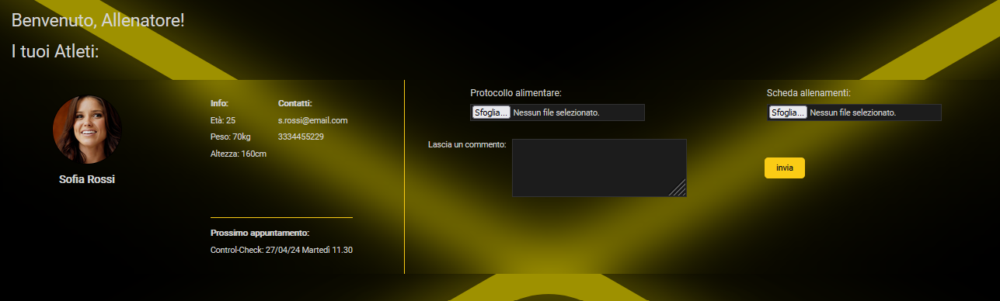

<!-- PROJECT LOGO -->
<br />
<div align="center">
    
  <h2 align="center">Reactive Fit</h2>
</div>

<!-- TABLE OF CONTENTS -->
<details>
  <summary>Contenuti</summary>
  <ol>
    <li>
      <a href="#about-the-project">The Project</a>
         <li><a href="#getting-started">Getting started</a></li>
        <li><a href="#built-with">Built With</a></li>
    </li>
    <li><a href="#contributing">Contributing</a></li>
  </ol>
</details>

<!-- ABOUT THE PROJECT -->

## The Project


<p>ReactiveFit è l'app progettata e realizzata durante il corso intensivo di programmazione Develhope. Essa si propone di mettere in contatto utenti che vogliono migliorare il proprio stile di vita grazie a palestra e nutrizione e professionisti del settore fitness.
</p>
<p>L'utente, una volta registrato, avrà a disposizione una serie di strumenti utili a tracciare il proprio percorso. </p>


<p> La Dashboard utente permetterà di registrare i propri allenamenti,le ore di sonno e le calorie consumate. Gli sarà possibile inoltre registrare le proprie variazioni di peso e l'acqua giornaliera consumata.</p></p>


<p> Un calendario degli eventi personalizzato lo aiuterà a non perdere nessun allenamento</p>

</img>
<p> Mentre nella sezione workout avrà una descrizione dettagliata di ogni esercizio proposto. In questa sezione troverai ogni tipo di allenamento che cerchi. </p>
</br>
<p> Nella sezione notizie potrai trovare gli ultimi aggiornamenti nel settore </p>
</br>
<div >
 
<p> Il personal trainer avrà una dashboard nel quale visualizzare i progressi dei propri utenti con la possibilità di inviare feedback o file.</p> 
</div>
</br>
</br>
</br>
<!-- GETTING STARTED -->

### Getting Started

<h4>Per ottenere una copia locale attiva e funzionante, segui questi semplici passaggi:</h4>

1.Se non l'hai già fatto installa Node.js e Visual Studio Code sul PC;

2. Dal Terminale fai il clone della repository:
   ```sh
   git clone https://github.com/AlexCastels/React-Project.git
   ```

<!-- BUILT WITH -->

### Built With

- HTML
- CSS
- JavaScript
- React.js
- Node.js
- PostgreSQL
- Express.js
- Tailwind CSS


<!-- CONTRIBUTING -->

## Contributing

Realizzato da :

<ul>
<li><h4 ><a href="https://github.com/AlexCastels"> The TeamLead Alessandro Castelli</a></h4></li>
<li><h4><a href="https://github.com/Annagiusi96">Anna Giusi Volpe</a></h4></li>
<li><h4 ><a href="https://github.com/benni90100">Benedetto Miceli</a></h4></li>
<li><h4 ><a href="https://github.com/paluzz34">Chiara Paluzzi</a></h4></li>
<li><h4 ><a href="https://github.com/chiaRapisar">Chiara Rapisardi</a></h4></li>
</ul>

<h6 align="center">Project Link: [https://github.com/AlexCastels/React-Project.git]</h5>
